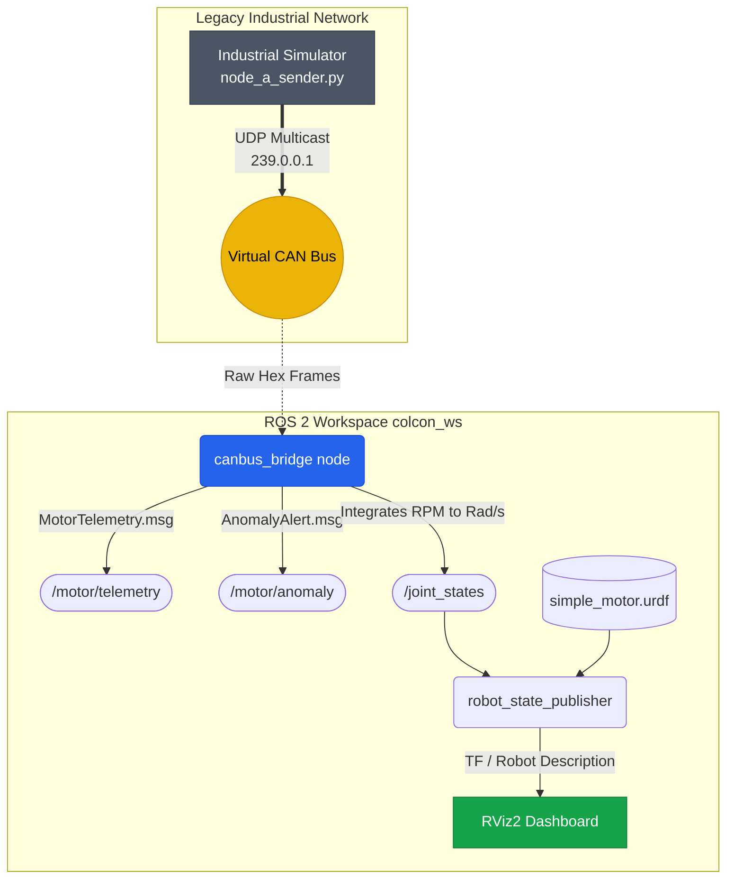

<div align="center">
  <h1>🚀 ROS2 Industrial CANbus Bridge & Visualization</h1>
  <p>A robust bridge to bring legacy UDP Multicast CANbus industrial networks into modern robotics (ROS 2) with real-time RViz2 3D visualization and Machine Learning anomaly detection.</p>
  
  
  
  
</div>

## 📖 Overview

This repository upgrades a standalone Python-based **Virtual Industrial CANbus Analyzer** into a fully-fledged **ROS 2 (Robot Operating System) ecosystem**. It intercepts raw hex telemetry data (RPM, Temperature, Torque, Current, Error Flags) transmitted over UDP Multicast, decodes it in real-time, and publishes it to native ROS 2 topics using Custom Message definitions.

This enables advanced robotics tooling—such as **RViz2** and **Gazebo**—to natively subscribe to industrial equipment, visualize motor kinematics in 3D, and respond to Machine Learning anomaly alerts on the fly.

---

## 🏗️ System Architecture & Data Flow

The project seamlessly bridges a standard UDP network into the ROS 2 computational graph.



### 🧩 ROS 2 Topic Graph
*   **`/motor/telemetry`** `(canbus_msgs/msg/MotorTelemetry)`: Emits engineering values parsed from raw bytes.
*   **`/motor/anomaly`** `(canbus_msgs/msg/AnomalyAlert)`: Triggered when the AI node detects system irregularities.
*   **`/joint_states`** `(sensor_msgs/msg/JointState)`: RPM is continuously integrated into angular position (Radians/sec) to animate the 3D URDF model.

---

## 🗂️ Project Structure

The repository is a standard `colcon` workspace divided into three primary packages:

```text
ROS2-Industrial-CANbus/
├── src/
│   ├── canbus_msgs/                 # C++ Package
│   │   └── msg/                     # Custom ROS2 Message definitions
│   │       ├── MotorTelemetry.msg
│   │       └── AnomalyAlert.msg
│   │
│   ├── canbus_bridge/               # Python Package
│   │   └── canbus_bridge/
│   │       ├── can_to_ros_node.py   # The core bridge (UDP to ROS Publisher)
│   │       └── can_protocol.py      # CAN byte decoding logic
│   │
│   └── canbus_visualization/        # CMake Package
│       ├── urdf/
│       │   └── simple_motor.urdf    # 3D Kinematic model of the motor
│       ├── rviz/
│       │   └── dashboard.rviz       # RViz2 Layout Configuration
│       └── launch/
│           └── visualize.launch.py  # Spins up RSP, Bridge, and RViz2 at once
└── README.md
```

---

## ⚙️ Installation & Setup (Ubuntu 24.04 / WSL2)

### 1. Prerequisites
Ensure you have **ROS 2 Jazzy Jalisco** installed.
```bash
sudo apt update
sudo apt install ros-jazzy-desktop python3-colcon-common-extensions -y
```

### 2. Python Dependencies
The bridge relies on `python-can` and data science libraries for anomaly handling.
```bash
pip3 install python-can msgpack scikit-learn pandas rich --break-system-packages
```

### 3. Build the Workspace
Navigate to the root of this repository and compile using `colcon`:
```bash
source /opt/ros/jazzy/setup.bash
colcon build --symlink-install
```

---

## 🚀 Usage Guide

To bring up the entire environment, you will need **three separate terminal windows**.

### Terminal 1: Launch the ROS 2 Environment & RViz2
Source your newly built workspace and launch the visualization package. This single launch file starts the bridge node, loads the URDF, and opens RViz2.
```bash
source install/setup.bash
ros2 launch canbus_visualization visualize.launch.py
```
*Result:* RViz2 opens, displaying a stationary 3D motor model waiting for telemetry data.

### Terminal 2: Start the Legacy CAN Simulator
In a separate terminal, launch your external UDP CAN generator (Node A).
```bash
python3 node_a_sender.py
```
*Result:* The bridge in Terminal 1 instantly catches the UDP multicast traffic. The red rotor in RViz2 begins physically spinning in real-time matching the exact RPM transmitted over the CAN bus!

### Terminal 3: Inspect ROS 2 Topics (Optional)
To verify the raw data conversion, echo the custom telemetry topic in a third terminal:
```bash
source /opt/ros/jazzy/setup.bash
source install/setup.bash
ros2 topic echo /motor/telemetry
```
*Expected Output:*
```yaml
rpm: 1450.4
temperature: 42.1
torque: 12.4
voltage: 220.0
current: 5.6
is_overheat: false
is_overcurrent: false
is_undervoltage: false
```

---
<div align="center">
  <i>Developed to showcase seamless Edge AI & Robotics Integration.</i>
</div>
